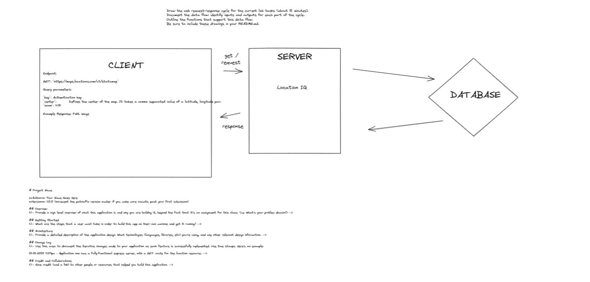
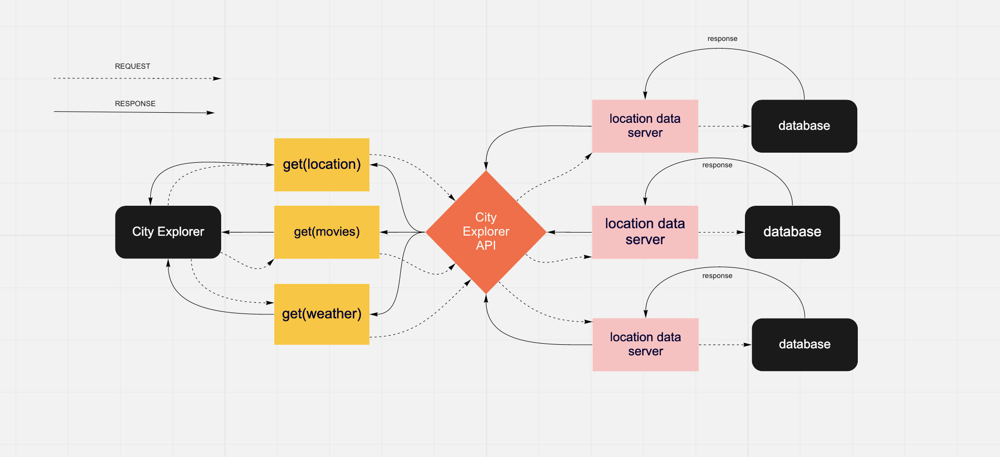

# City Explorer

**Author**: J.Matt Miguel
**Version**: 1.0.0 

## Overview
Deployed page https://city-explorer-jamiguel23.netlify.app/ 

## Getting Started

### Lab 6 wireframe

### lab 9 Wirefarame

## Architecture
<!-- Provide a detailed description of the application design. What technologies (languages, libraries, etc) you're using, and any other relevant design information. -->

## Change Log
<!-- Use this area to document the iterative changes made to your application as each feature is successfully implemented. Use time stamps. Here's an example:

01-01-2001 4:59pm - Application now has a fully-functional express server, with a GET route for the location resource. -->

## Credit and Collaborations

- Lab6 WireFrame exercise with Rey Mercado
- Lab9 WireFrame with Jacob Choi
